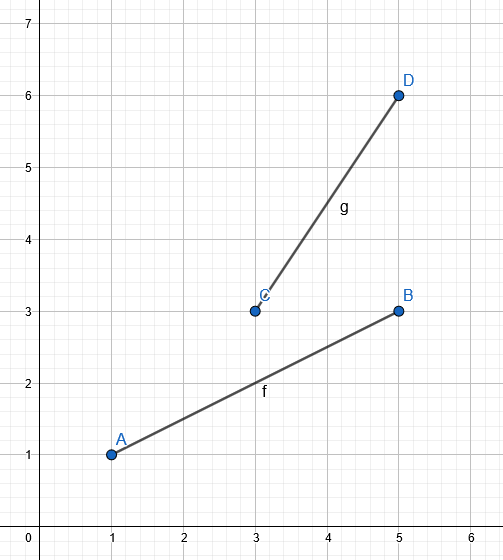

# segseg

[](https://travis-ci.org/tmpvar/segseg)

Intersection detection between two line segments in 2d space.


## Usage

```javascript
import segseg from 'segseg'


/*
                (0, 5)
                   │
  (-10, 0) ────────+───────  (10, 0)
                   │
                (0, -5)
*/

const isect = [ NaN, NaN ] // the output vector where collision point is stored

//                       seg 1                   seg 2
//                ┌───────────────────┐   ┌─────────────────┐
if (segseg(isect, [ -10, 0 ], [ 10, 0 ],  [ 0, 5 ], [ 0, -5 ]))
    console.log('intersected!', isect.join(','))  // output:   intersected! 0,0

```

You can also specify an `epsilon` value, which sets the maximum distance for a segment to be considered on another segment. By default this is `0`, but there are some use cases where you might want to adjust this. For example, if you are working on a pixel based rendering, and want any segments within `1` of each other to be considered intersecting, since it's rendering will make it visually appear to be on the segment:



```javascript
const EPSILON = 1
//                   seg 1               seg 2
//            ┌────────────────┐   ┌────────────────┐
segseg(isect, [ 1, 1 ], [ 5, 3 ],  [ 3, 3 ], [ 5, 6 ], ESPILON)  // returns true

```


## Node compatibility

This is a pure es module, and requires node v12+ to run. However if you're using a popular bundler such as rollup, webpack, etc. This should be compatible with most frontend setups too.


## Credits

This code was ported from Mukesh Prasad's [example implementation](http://www.realtimerendering.com/resources/GraphicsGems/gemsii/xlines.c) which was included in graphics gems 2.

Internally the code uses a point-segment check for some edge cases, from https://gist.github.com/mattdesl/47412d930dcd8cd765c871a65532ffac
